<div align="center">

<picture>
  <source media="(prefers-color-scheme: dark)" srcset="assets/icon-dark.png">
  
</picture>

# Grab

**Download video, audio and subtitles — up to 24K, with the audio always merged.**
**Transcribe on your own machine. Ask AI about what was said.**

By **Jagadeesh Kumar S** · version **1.0.1** · [ipconfig.co.network](https://ipconfig.co.network)

 &nbsp; 

<sub>The app icon, light (default) and dark.</sub>

</div>

## Download

| Platform | Download | Notes |
|---|---|---|
| 🍎 **macOS** Apple Silicon | [Grab_1.0.1_aarch64.dmg](https://github.com/JKS-sys/grab-08-oct-2026-releases/releases/latest/download/Grab_1.0.1_aarch64.dmg) | M1 and later |
| 🍎 **macOS** Intel | [Grab_1.0.1_x64.dmg](https://github.com/JKS-sys/grab-08-oct-2026-releases/releases/latest/download/Grab_1.0.1_x64.dmg) | macOS 10.15+ |
| 🪟 **Windows** x64 | [Grab_1.0.1_x64-setup.exe](https://github.com/JKS-sys/grab-08-oct-2026-releases/releases/latest/download/Grab_1.0.1_x64-setup.exe) | Windows 10 and 11 |
| 🪟 **Windows** ARM64 | [Grab_1.0.1_arm64-setup.exe](https://github.com/JKS-sys/grab-08-oct-2026-releases/releases/latest/download/Grab_1.0.1_arm64-setup.exe) | Snapdragon laptops |
| 🐧 **Linux** x64 | [.deb](https://github.com/JKS-sys/grab-08-oct-2026-releases/releases/latest/download/Grab_1.0.1_amd64.deb) · [.AppImage](https://github.com/JKS-sys/grab-08-oct-2026-releases/releases/latest/download/Grab_1.0.1_amd64.AppImage) | Ubuntu, Debian, Mint… |
| 🐧 **Linux** ARM64 | [.deb](https://github.com/JKS-sys/grab-08-oct-2026-releases/releases/latest/download/Grab_1.0.1_arm64.deb) | Raspberry Pi 5, ARM laptops |
| 💻 **ChromeOS** | the Linux **.deb** | Settings → Developers → Linux, then open the file |
| 😈 **FreeBSD** x64 | [tarball](https://github.com/JKS-sys/grab-08-oct-2026-releases/releases/latest/download/Grab_1.0.1_freebsd_amd64.tar.gz) | unpack, run `./grab` |

**macOS first launch:** drag Grab to Applications, then run once in Terminal:
```sh
xattr -cr /Applications/Grab.app
```
Grab updates itself after that, on every platform except FreeBSD.

## What it looks like

### Start-up

<picture>
  <source media="(prefers-color-scheme: dark)" srcset="assets/splash-2-dark.webp">
  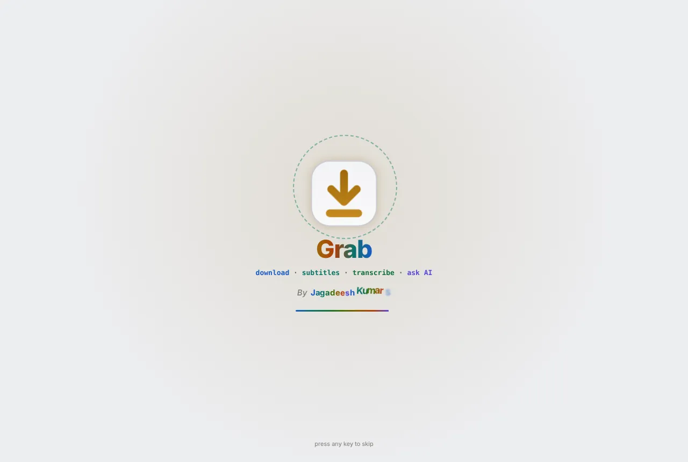
</picture>

The logo draws itself, sparks fly, the tagline types out and "By Jagadeesh Kumar S" springs in letter by letter, with its own sound. Any key skips it.

### Downloads

<picture>
  <source media="(prefers-color-scheme: dark)" srcset="assets/downloads-dark.webp">
  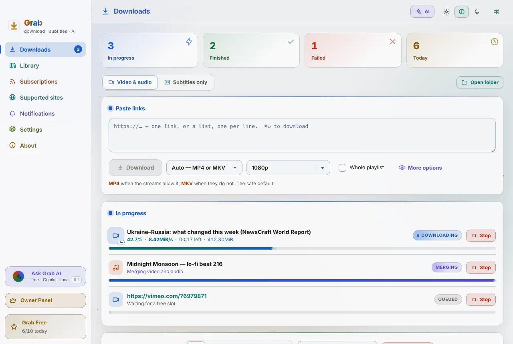
</picture>

Paste one link or a hundred. Pick the format and a quality cap from 480p to 24K; the audio is always merged in. Live jobs show speed, time left and a dancing equaliser.

### Subtitles only

<picture>
  <source media="(prefers-color-scheme: dark)" srcset="assets/subtitles-dark.webp">
  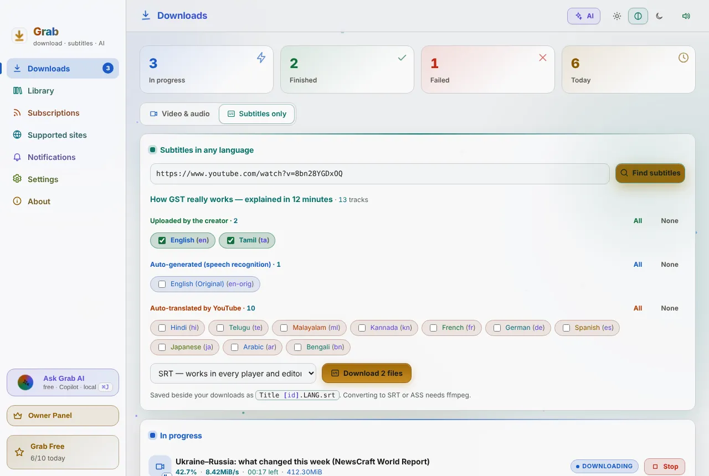
</picture>

Every subtitle language a video has: the creator's own, auto-generated and auto-translated, each labelled. Tick the ones you want and get just those files as SRT, VTT or ASS.

### More options

<picture>
  <source media="(prefers-color-scheme: dark)" srcset="assets/options-dark.webp">
  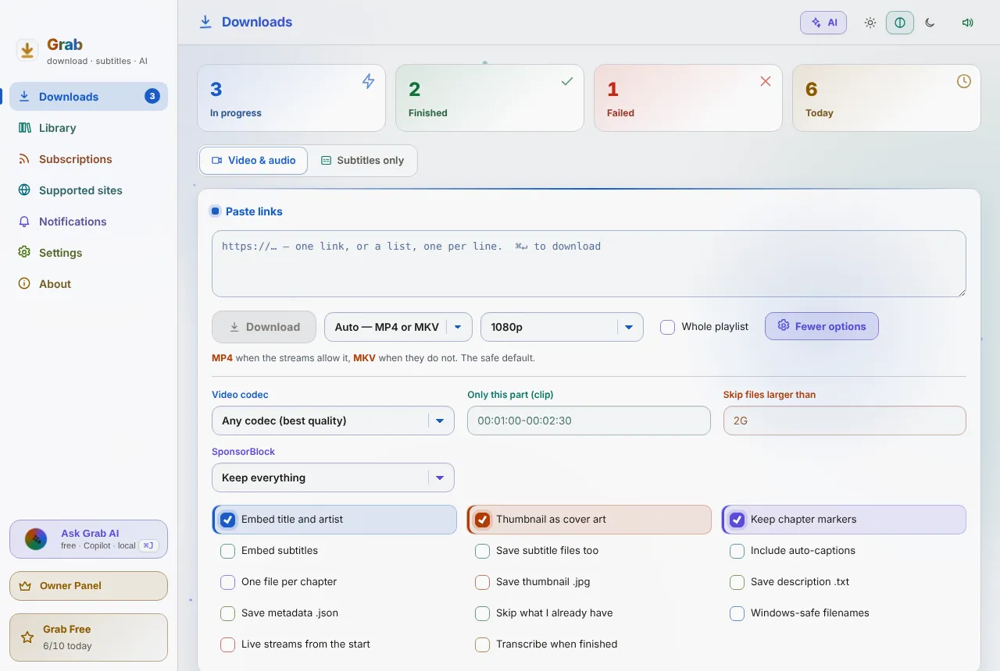
</picture>

Codec, audio bitrate, clip a section, playlist ranges, one file per chapter, skip what you already have, size limits, cookies from your browser, and a dry run of the exact command.

### Grab AI (⌘J)

<picture>
  <source media="(prefers-color-scheme: dark)" srcset="assets/ai-chat-dark.webp">
  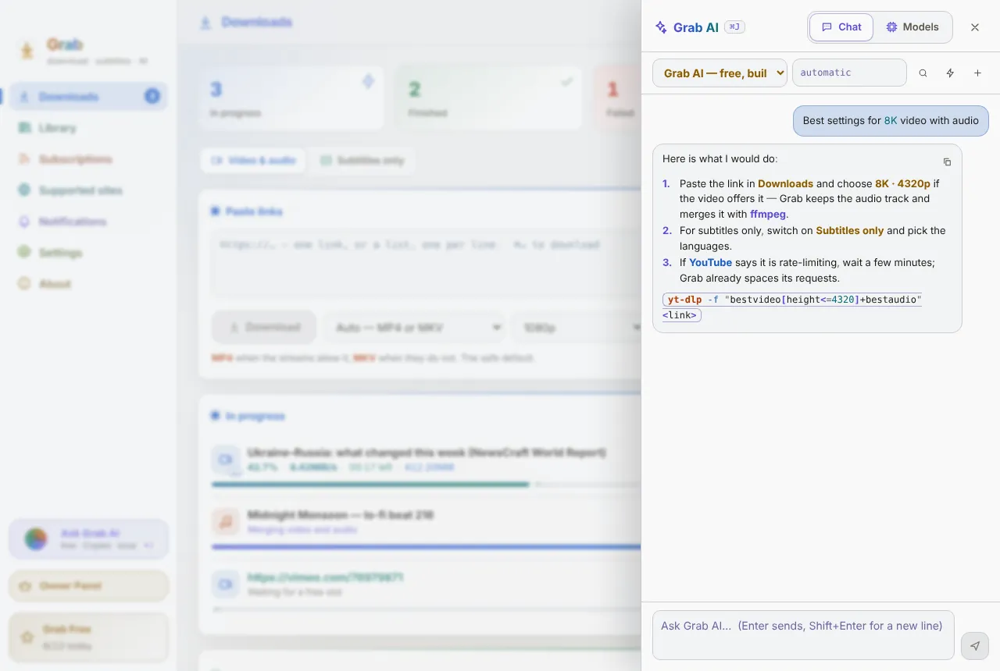
</picture>

Free built-in AI that knows what is in your queue. Also GitHub Copilot, GitHub Models, every local model and any online provider. Replies stream, code is coloured.

### Every local AI

<picture>
  <source media="(prefers-color-scheme: dark)" srcset="assets/ai-models-dark.webp">
  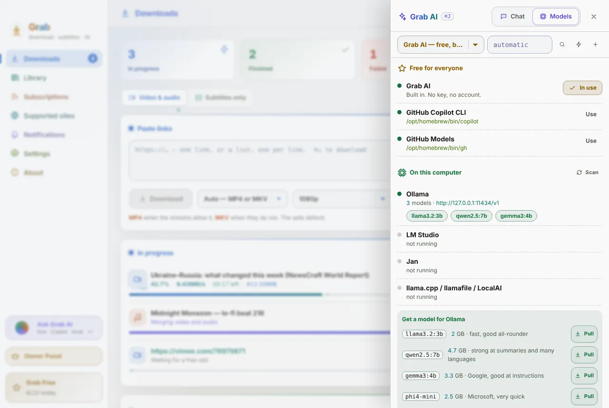
</picture>

Ollama, LM Studio, Jan, llama.cpp, GPT4All, KoboldCpp, vLLM, Msty and AnythingLLM are found by themselves. Start Ollama and pull a model with one click.

### Library

<picture>
  <source media="(prefers-color-scheme: dark)" srcset="assets/library-dark.webp">
  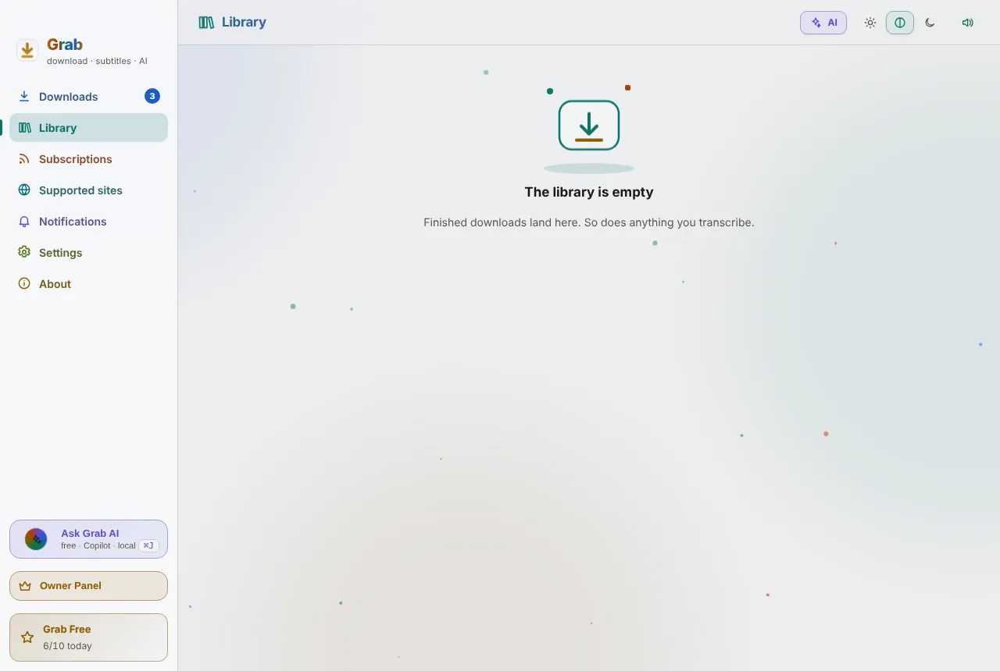
</picture>

Everything you downloaded, transcribed on your own machine with whisper.cpp, searchable by what was said. Summaries, chapters and quotes with AI.

### Subscriptions

<picture>
  <source media="(prefers-color-scheme: dark)" srcset="assets/subs-dark.webp">
  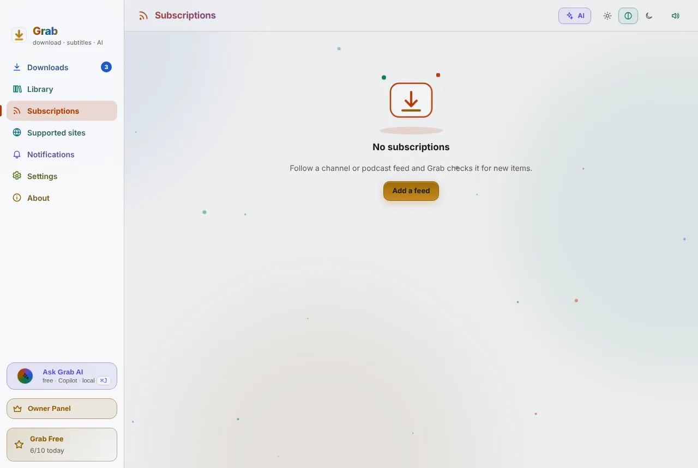
</picture>

Follow channels and feeds; new uploads queue themselves with the format you chose for that feed.

### Settings

<picture>
  <source media="(prefers-color-scheme: dark)" srcset="assets/settings-formats-dark.webp">
  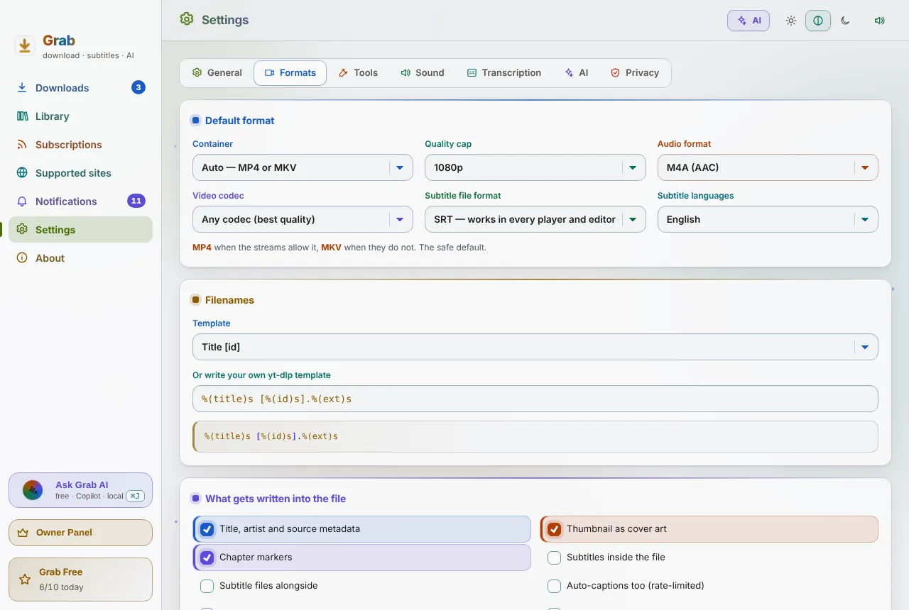
</picture>

Every option in plain words, each field in its own colour, and the yt-dlp command shown exactly as Grab will run it.

### Sound

<picture>
  <source media="(prefers-color-scheme: dark)" srcset="assets/settings-sound-dark.webp">
  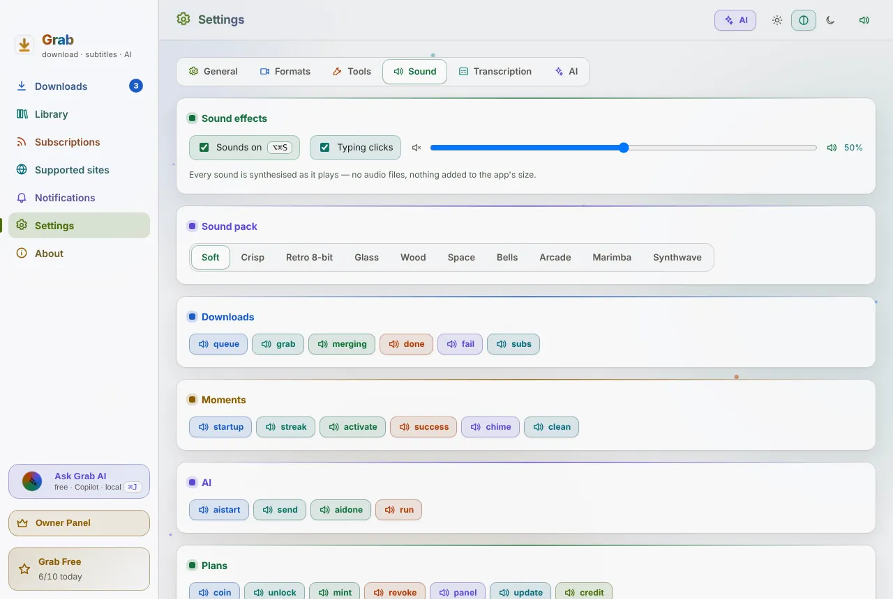
</picture>

Every sound is synthesised as it plays, in ten packs, with no audio files in the app. Each section has its own note.

### Shortcuts

<picture>
  <source media="(prefers-color-scheme: dark)" srcset="assets/shortcuts-dark.webp">
  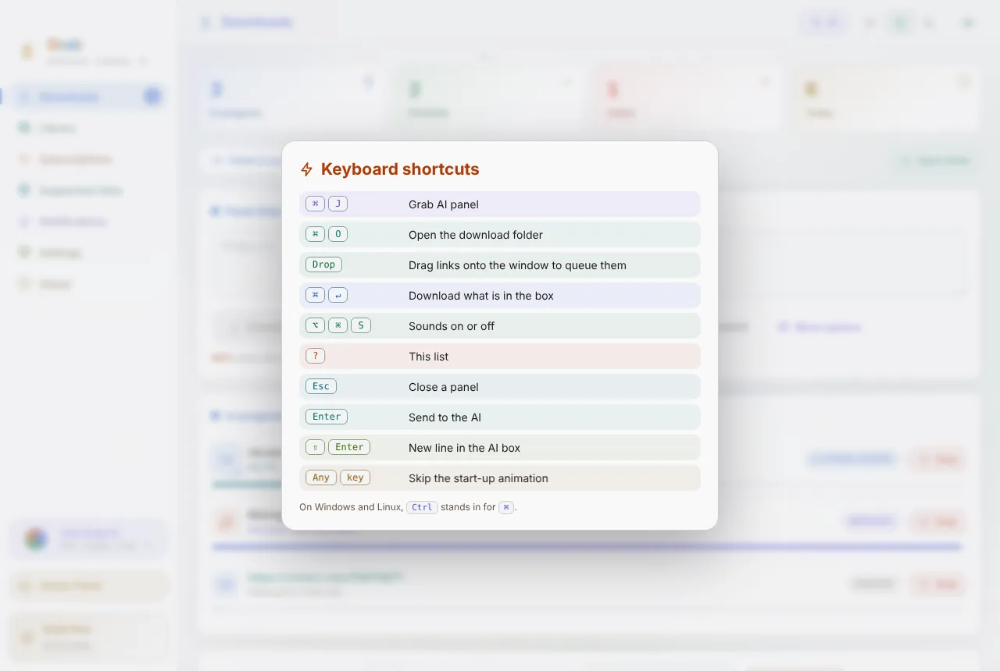
</picture>

Press ? anywhere for every keyboard shortcut, each in its own colour.

### Grab Pro

<picture>
  <source media="(prefers-color-scheme: dark)" srcset="assets/plan-dark.webp">
  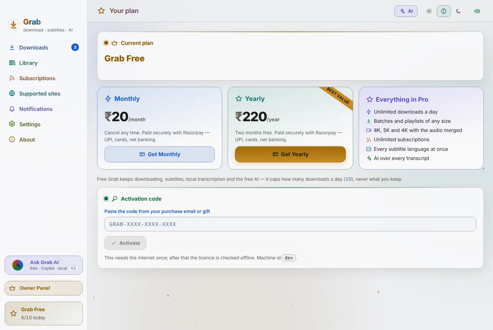
</picture>

₹20 a month or ₹220 a year through Razorpay: UPI, cards, net banking. Grab unlocks itself the moment payment clears. Activation and lifetime codes work too.

### Owner Panel

<picture>
  <source media="(prefers-color-scheme: dark)" srcset="assets/owner-overview-dark.webp">
  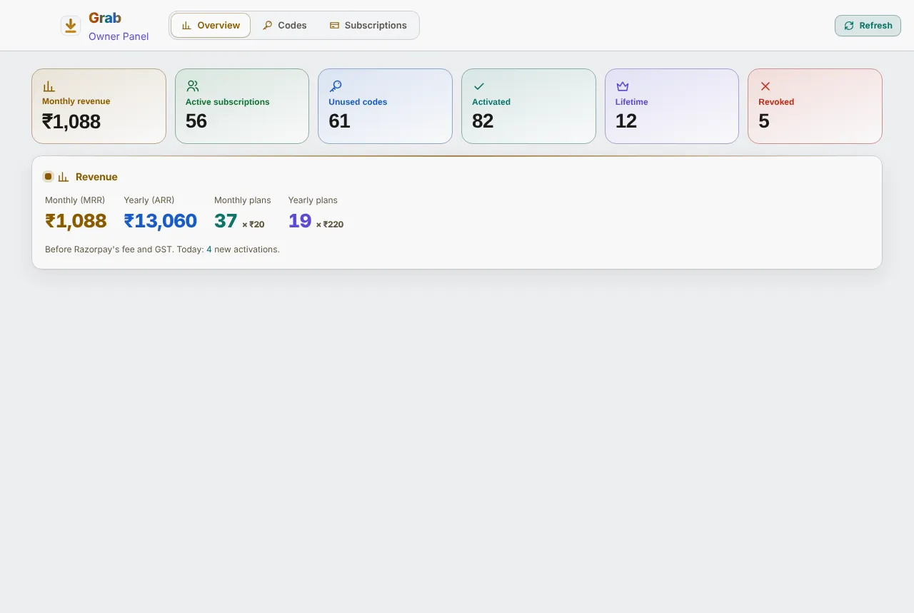
</picture>

On the owner's Mac only, in its own window: revenue, codes (mint, revoke, restore, unbind) and Razorpay subscriptions (pause, resume, cancel, invoices).

## Free and Pro

Free Grab downloads, saves subtitles, transcribes locally and includes the free built-in AI, up to 10 downloads a day.
**Grab Pro** is ₹20 a month or ₹220 a year (UPI, cards, net banking through Razorpay) and removes every limit.

## What Grab does not do

It does not break DRM. Encrypted streaming services — Prime Video, Netflix, Disney+ Hotstar and the like — are out of scope.
Cookies from your browser only reach what your own account can already watch.

---

<div align="center"><sub>Made by Jagadeesh Kumar S · <a href="mailto:JKS.sys@icloud.com">JKS.sys@icloud.com</a> · <a href="https://www.youtube.com/@JKS-sys">youtube.com/@JKS-sys</a></sub></div>
